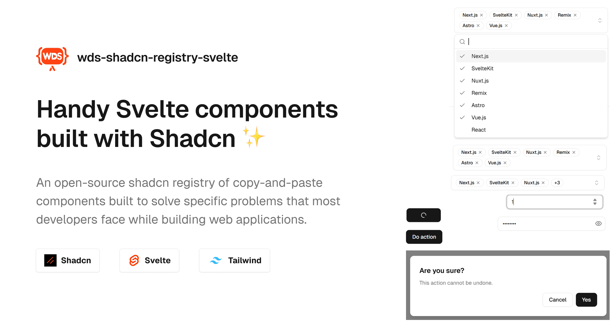

 
 <h1 align="center">
  wds-shadcn-registry-svelte
 </h1>

[wds-shadcn-registry-svelte](https://localhost:5173) is an unofficial community-led [Svelte](https://svelte.dev) port of [wds-shadcn-registry](https://wds-shadcn-registry.netlify.app).

> **Note**   **This project is not affiliated with wds-shadcn-registry**  

[wds-shadcn-registry-svelte](https://localhost:5173) is an open-source collection of copy-and-paste shadcn components.

## Documentation

Visit https://localhost:5173 to view the documentation.

## Credits

We are grateful for the contributions of the open-source community, particularly:

- [wds-shadcn-registry](https://wds-shadcn-registry.netlify.app)
- [shadcn-svelte](https://shadcn-svelte.com)
- [bits-ui](https://bits-ui.com)

These projects form the backbone of wds-shadcn-registry-svelte, allowing us to build a powerful copy-and-paste components.

## License

Licensed under the [MIT license](https://github.com/EpicAlbin03/wds-shadcn-registry-svelte/blob/main/LICENSE.md).
